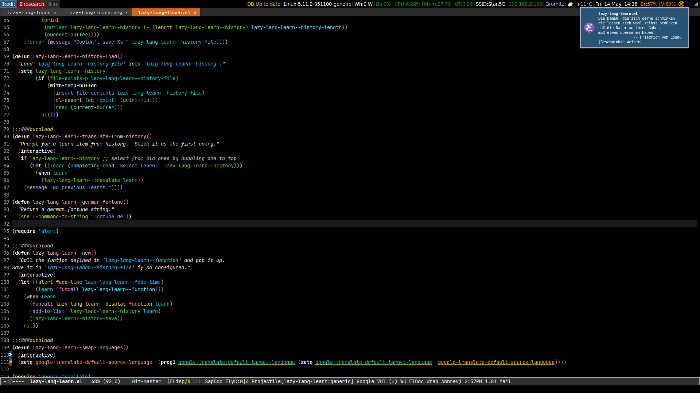
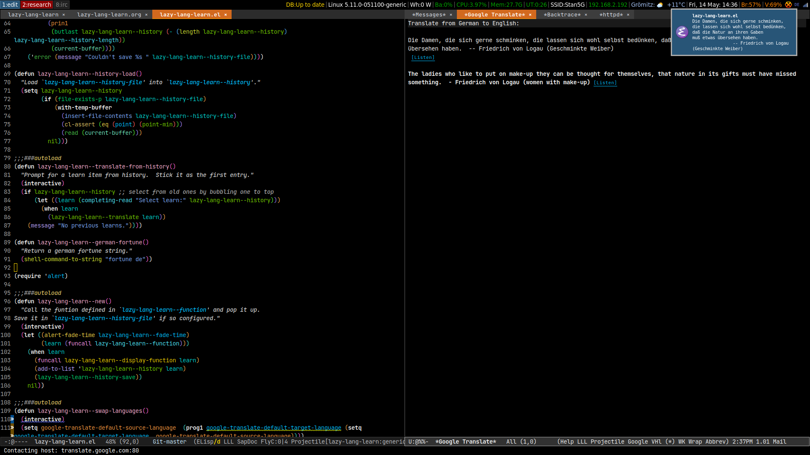
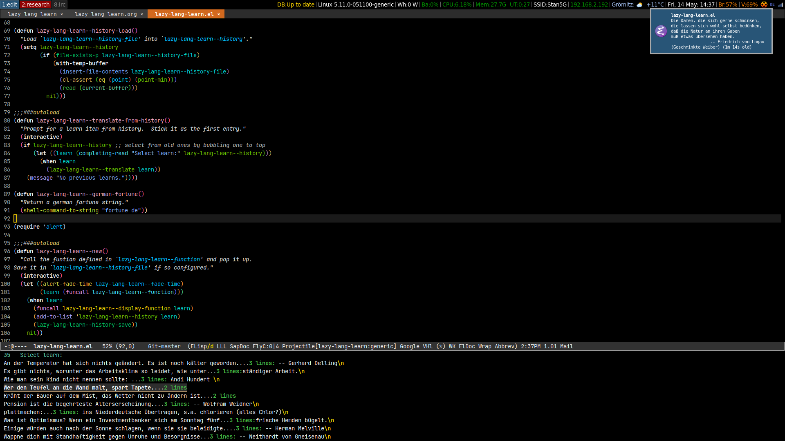

- [lazy-lang-learn.el periodic display of new snippet to translate](#org0da95c9)
  - [Screenshots](#orgd16b2b5)
    - [A new snippet pops after `lazy-lang-learn--period`](#org8a9c499)
    - [translate it with `lazy-lang-learn-translate`](#org0d9b697)
    - [translate older snippets  with `lazy-lang-learn-translate-from-history`](#org4c325e5)
  - [requirements](#org04f5e83)
    - [google-translate](#orge2188e1)
    - [alert](#org2c8e6c4)
    - [fortunes-de](#orgd2739e7)
  - [usage](#orga43457c)
  - [customisation](#org11c5383)
    - [`lazy-lang-learn--period`](#orge98a581)
    - [`lazy-lang-learn--function`](#org095c8eb)
    - [`lazy-lang-learn--display-function`](#orgc0097e5)
    - [`lazy-lang-learn--history-length`](#orgad7491c)
    - [`lazy-lang-learn--history-file`](#orgec251c3)
    - [`lazy-lang-learn--lighter`](#org755bc8c)
  - [TODO](#orgd6f724f)
    - [have the minor mode timer pop up existing ones from the history if so configured.](#org5bb84c0)
    - [hot key to remove immediately last snippet](#orge7cd7d1)
    - [delete from history](#org6292857)
    - [migrate the history format to an org file maybe so add things like view count etc etc](#org68703b2)

Lazy timer based display of things to learn. Ability to recall and translate with presistance across sessions.


<a id="org0da95c9"></a>

# lazy-lang-learn.el periodic display of new snippet to translate

Defines a new minor-mode `lazy-lang-learn-mode` which calls out to `lazy-lang-learn--function` for a new snippet and displays it with `lazy-lang-learn--display-function`. Stores it in `lazy-lang-learn--history` which can be browsed and translated via `lazy-lang-learn--translate-from-history`. Newly displayed snippets can be immediately translated using `lazy-lang-learn-translate`.


<a id="orgd16b2b5"></a>

## Screenshots


<a id="org8a9c499"></a>

### A new snippet pops after `lazy-lang-learn--period`




<a id="org0d9b697"></a>

### translate it with `lazy-lang-learn-translate`




<a id="org4c325e5"></a>

### translate older snippets  with `lazy-lang-learn-translate-from-history`




<a id="org04f5e83"></a>

## requirements


<a id="orge2188e1"></a>

### google-translate

This whole thing is based around using [google-translate](https://github.com/atykhonov/google-translate), a package that allows you to translate strings using Google Translate service directly from GNU Emacs. I have some customisations to this which can be found under [my own emacs configuration](https://github.com/rileyrg/Emacs-Customisations) in [rgr/google.el](https://github.com/rileyrg/Emacs-Customisations/blob/master/etc/elisp/rgr-google.el)


<a id="org2c8e6c4"></a>

### alert

The default `lazy-lang-learn--display-function` is set to `'alert`. See [alert](https://github.com/jwiegley/alert).


<a id="orgd2739e7"></a>

### fortunes-de

Debian comes with `fortunes-de` which is the default snippet generator used by `lazy-lang-learn--function` default function `lazy-lang-learn--german-fortune`.

```bash
sudo apt install fortunes-de
```


<a id="orga43457c"></a>

## usage

```emacs-lisp
(use-package lazy-lang-learn
  :straight (lazy-lang-learn :local-repo "~/development/projects/emacs/lazy-lang-learn" :type git :host github :repo "rileyrg/lazy-lang-learn" )
  :bind
  ("C-c L" . lazy-lang-learn-mode)
  ("<f12>" . lazy-lang-learn-translate)
  ("S-<f12>" . lazy-lang-learn-translate-from-history))
```


<a id="org11c5383"></a>

## customisation

Customisation group `lazy-lang-learn`


<a id="orge98a581"></a>

### `lazy-lang-learn--period`

Idle time in seconds before it fetches a new snippet to display


<a id="org095c8eb"></a>

### `lazy-lang-learn--function`

Holds the name of a function to return snippets to store and later translate. Currently defaults to `lazy-lang-learn--german-fortune` which simply calls out to the shell to get a unix fortune snippet&#x2026;

```emacs-lisp
(defun lazy-lang-learn--german-fortune()
  "Return a german fortune string."
  (shell-command-to-string "fortune de"))
```


<a id="orgc0097e5"></a>

### `lazy-lang-learn--display-function`

Holds the name of a function to display new snippets to browse. Defaults to [alert](https://github.com/jwiegley/alert).


<a id="orgad7491c"></a>

### `lazy-lang-learn--history-length`

How many snippets to keep and save in `lazy-lang-learn--history-file`


<a id="orgec251c3"></a>

### `lazy-lang-learn--history-file`

The file used to store language snippets.


<a id="org755bc8c"></a>

### `lazy-lang-learn--lighter`

The minor mode indicator in the mode line.


<a id="orgd6f724f"></a>

## TODO


<a id="org5bb84c0"></a>

### have the minor mode timer pop up existing ones from the history if so configured.


<a id="orge7cd7d1"></a>

### hot key to remove immediately last snippet


<a id="org6292857"></a>

### delete from history


<a id="org68703b2"></a>

### migrate the history format to an org file maybe so add things like view count etc etc
